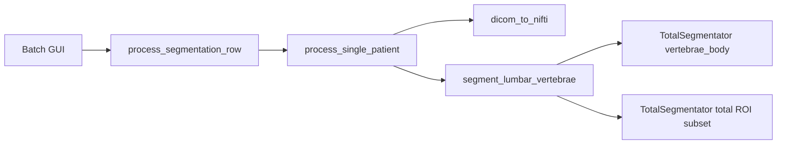

# Low-Memory Segmentation Plan

## Context

The memory error is happening during CPU segmentation from the batch GUI on a 16 GB Windows machine. The program must keep `vertebrae_body`; it is not optional for this workflow.

## Key Files

- [../scripts/gui_batch_verification.py](../scripts/gui_batch_verification.py) runs batch segmentation in a background thread inside the GUI process.
- [../src/pipeline.py](../src/pipeline.py) converts DICOM to NIfTI, calls segmentation, then calculates statistics and preview.
- [../src/segmentator.py](../src/segmentator.py) calls TotalSegmentator twice per case: mandatory `vertebrae_body`, then `total` with `roi_subset`.
- [../src/totalseg_local_weights.py](../src/totalseg_local_weights.py) contains a skip-body escape hatch, but this plan will not use it because `vertebrae_body` is required.

## Findings

TotalSegmentator's documented low-memory options include `fast`, `body_seg`, `force_split`, `roi_subset`, and `nr_thr_saving=1`. This repo already uses `roi_subset` for lumbar vertebrae, but it does not currently pass `nr_thr_saving`, `body_seg`, or `force_split`.

The highest-risk memory pattern is that one case performs two TotalSegmentator passes, then continues in the same Python process with full-volume CT and mask loading for statistics and preview.

## Recommended Approach

Implement a `Low-memory CPU mode` for the batch GUI and pipeline:

- When batch GUI device is `cpu`, make `Fast mode` strongly recommended or auto-enabled unless the user turns it off.
- Add a low-memory option that passes TotalSegmentator arguments `nr_thr_saving=1`, `nr_thr_resamp=1`, and `body_seg=True` where supported.
- Add an optional `force_split=True` toggle for large CTs. Keep it opt-in because TotalSegmentator warns it can hurt small fields of view.
- Keep `vertebrae_body` mandatory. Optimize around it by running it in the per-case worker, applying supported low-memory TotalSegmentator flags, collecting memory immediately after the call, and only then running the lumbar ROI pass.

## Batch Stability Change

Run each segmentation case in a separate subprocess instead of only a background Tk thread:

- Add a small single-case worker script that accepts a JSON job config and calls `process_single_patient()`.
- Update [../scripts/gui_batch_verification.py](../scripts/gui_batch_verification.py) to launch one worker per case, stream logs back, then read a result JSON.
- This releases PyTorch, nnU-Net, and TotalSegmentator memory after each patient exits, which is especially helpful on Windows and 16 GB RAM.
- Keep processing sequential, one case at a time.

## Secondary Memory Cleanup

After the segmentation peak is under control, reduce memory in post-processing:

- In [../src/segmentator.py](../src/segmentator.py), avoid `get_fdata()` defaulting to float64 for binary masks; load masks as boolean or `uint8` where possible.
- In [../src/statistics.py](../src/statistics.py), use `get_fdata(dtype=np.float32)` for CT data and avoid holding unnecessary mask arrays after each vertebra.
- In [../src/visualizer.py](../src/visualizer.py), load only the masks needed for the preview and release arrays after saving.

## Immediate Usage Workaround

Before code changes, the safest current settings for a 16 GB CPU run are:

- Use Batch GUI `Device = cpu` with `Fast mode` checked.
- Close other memory-heavy apps before starting the batch.
- Do not use `OPPOCT_SKIP_VERTEBRAE_BODY_SEG=1`; `vertebrae_body` remains required.
- Process only selected CT series, which the CSV workflow already appears to enforce via `series_instance_uid`.

## Implementation Tasks

- Add low-memory segmentation options through batch GUI, row processing, pipeline, and segmentator function signatures.
- Pass `nr_thr_saving=1`, `nr_thr_resamp=1`, `body_seg=True`, and optional `force_split=True` to TotalSegmentator calls.
- Keep `vertebrae_body` mandatory and make its TotalSegmentator pass use the same low-memory worker and cleanup path as the lumbar ROI pass.
- Move per-case batch segmentation from a Tk background thread into a single-case subprocess worker to release memory between cases.
- Use lower-memory dtypes for masks and CT arrays in segmentation intersection, statistics, and preview generation.
- Validate with one small CPU fast-mode case, then a two-case batch, checking logs and output compatibility.
